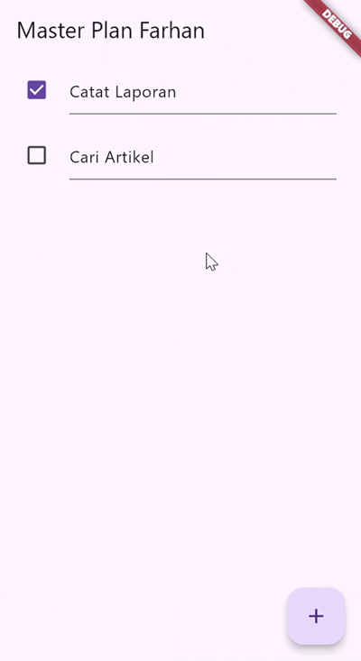
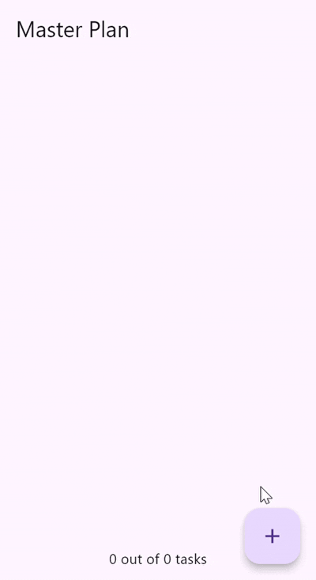

# master_plan


# Laporan Praktikum 1

## 2. Penjelasan Maksud dari Langkah 4 (data_layer.dart)

Pada langkah 4, dibuat file `data_layer.dart` yang berisi:

``` dart
export 'plan.dart';
export 'task.dart';
```

### Maksudnya apa?

File ini berfungsi sebagai "barrel file", yaitu satu file yang
mengekspor banyak file lain di dalam folder yang sama.

### Mengapa dilakukan demikian?

1.  Menyederhanakan import\
2.  Struktur proyek lebih rapi\
3.  Pemeliharaan lebih mudah

------------------------------------------------------------------------

## 3. Mengapa Perlu Variabel `plan`? Mengapa Dibuat Konstanta?

``` dart
const plan = Plan(
  name: 'Plan A',
  tasks: [],
);
```

### Alasan:

-   Menjadi model utama tempat menyimpan state.
-   Dibuat const karena nilai awal immutable dan lebih efisien.
-   Flutter menyarankan penggunaan objek immutable.

------------------------------------------------------------------------
## 4. Lakukan capture hasil dari Langkah 9 berupa GIF, kemudian jelaskan apa yang telah Anda buat!


Pada Langkah 9, kita membuat sebuah widget bernama _buildTaskTile() yang berfungsi untuk menampilkan setiap item Task dalam bentuk ListTile.

------------------------------------------------------------------------

## 5. Kegunaan Method pada Langkah 11 dan 13 dalam Lifecycle State

### initState()

-   Dipanggil sekali saat widget dibuat.
-   Untuk inisialisasi data.

### setState()

-   Digunakan untuk memberi tahu Flutter bahwa data berubah.
-   Memicu rebuild UI agar tampilannya update.


# Laporan Praktikum 2

## 2. Jelaskan mana yang dimaksud InheritedWidget pada langkah 1 tersebut! Mengapa yang digunakan InheritedNotifier?


``` dart
class MasterPlanProvider extends InheritedNotifier<ValueNotifier<MasterPlan>> {
  const MasterPlanProvider({
    super.key,
    required super.notifier,
    required super.child,
  });

  static ValueNotifier<MasterPlan> of(BuildContext context) {
    return context
        .dependOnInheritedWidgetOfExactType<MasterPlanProvider>()!
        .notifier!;
  }
}

```

- InheritedWidget Mendistribusikan data ke seluruh widget di bawahnya (subtree)


------------------------------------------------------------------------

## 3. Jelaskan maksud dari method pada langkah 3!

``` dart
static ValueNotifier<MasterPlan> of(BuildContext context) {
  return context
      .dependOnInheritedWidgetOfExactType<MasterPlanProvider>()!
      .notifier!;
}

```
akses cepat + auto register dependency + auto rebuild.

------------------------------------------------------------------------
## 4. Lakukan capture hasil dari Langkah 9 berupa GIF, kemudian jelaskan apa yang telah Anda buat!


Tampilan daftar Task menggunakan ListView.builder

Setiap task ditampilkan sebagai CheckboxListTile

Ketika user mengubah checkbox, task berubah status

UI diperbarui otomatis karena menggunakan InheritedNotifier


