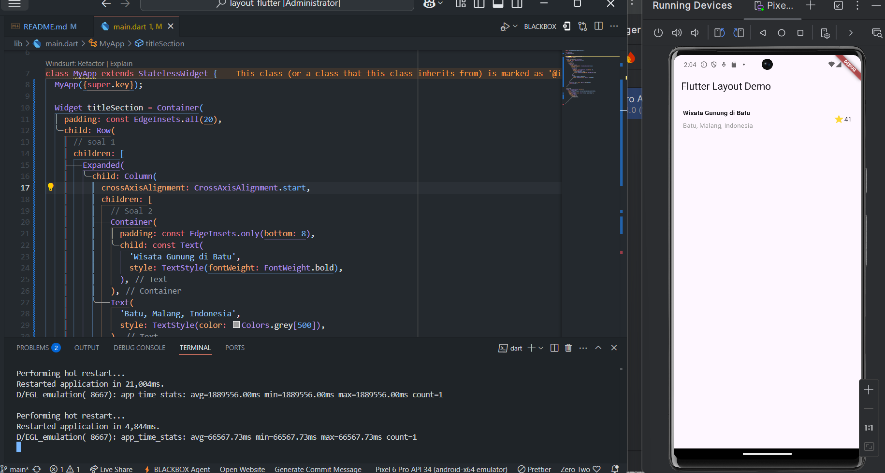
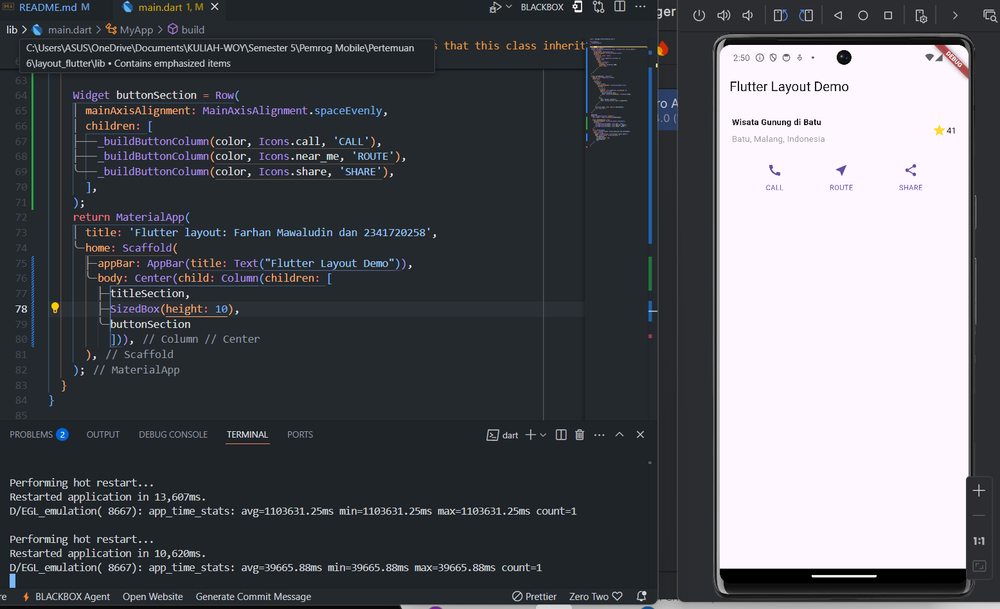
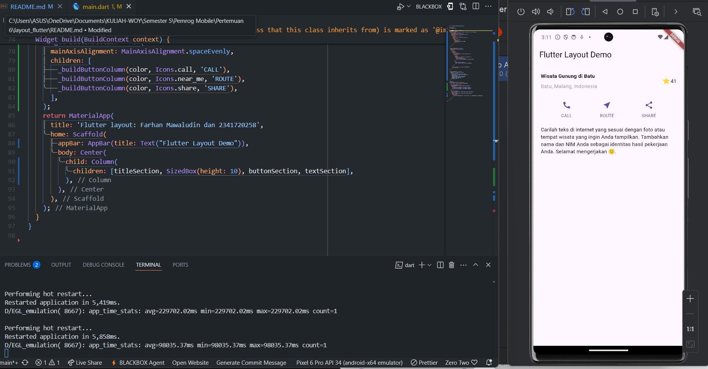
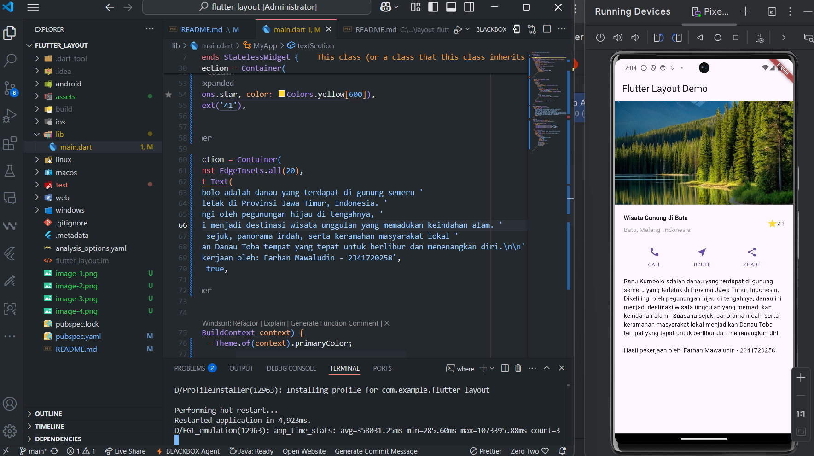
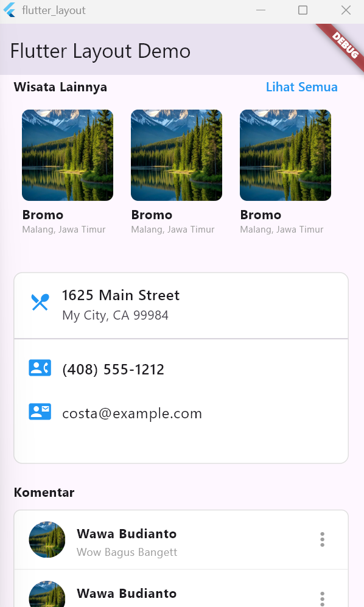
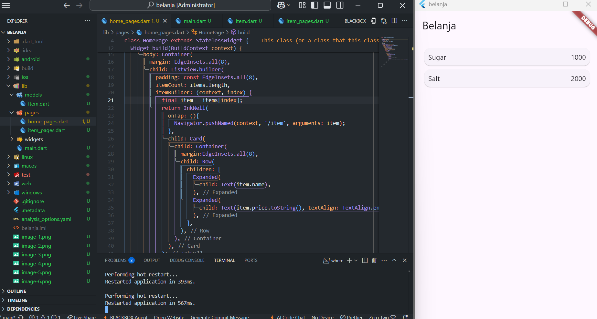
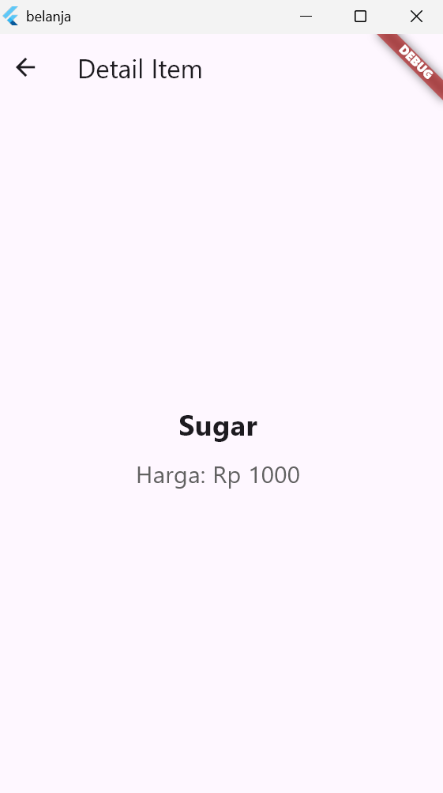
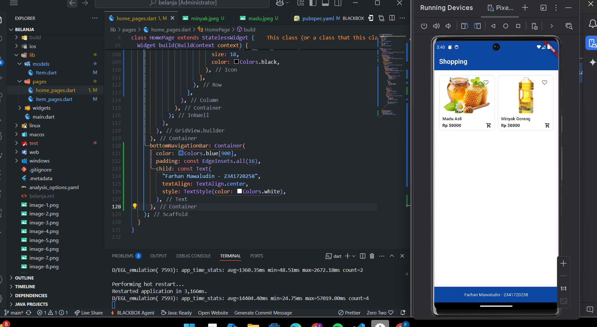
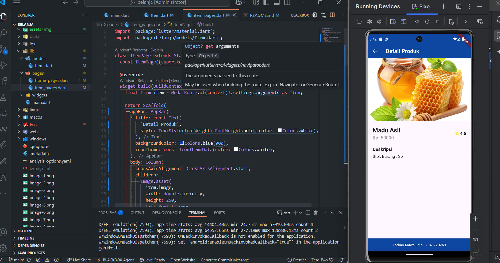

# Pertemuan 6 - Layout dan Navigasi

## Praktikum 1

### Buat Projek

   

### Implementasi title row
  

### Soal 1,2,3

  

## Praktikum 2 - Implementasi button row

### Buat method untuk membuat tombol dan membuat widget tombol

  

## Praktikum 3 - Implementasi text section

### Membuat widget untuk bagian teks

  

## Praktikum 4 - Implementasi image section

## Tugas Praktikum 1

 
membuat basic layout

  

## Praktikum 5 - Membangun Navigasi di Flutter
 

## Tugas Praktikum 2
Membuat aplikasi belanja
 
 
 

