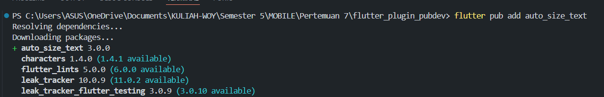
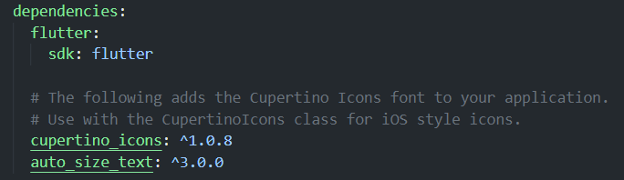
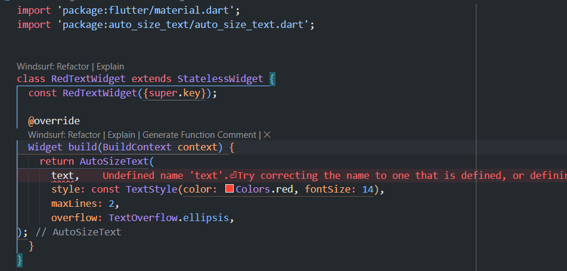
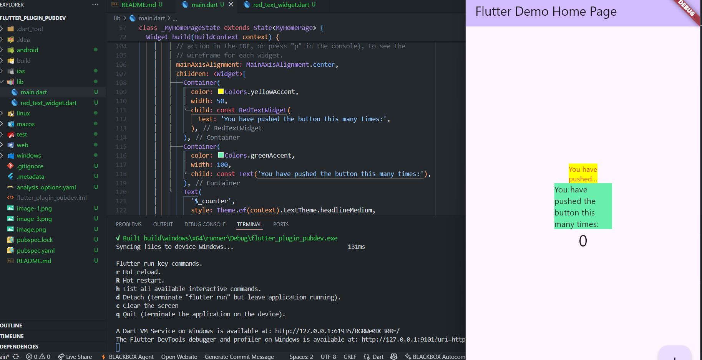

# Praktikum 1

## Menambahkan Plugin
 

  

## Buat file red_text_widget.dart

Terjadi eror karena text menerima variabel dari luar sedangkan disini belum   dideklarasikan 

## memanggil class di main

  

1. Jelaskan maksud dari langkah 2 pada praktikum tersebut! 
Jawab : pada langkah kedua adalah untuk menambahkan plugin sebagai depedencies didalam projek  

2. Jelaskan maksud dari langkah 5 pada praktikum tersebut! 
Jawab : pada langkah ini memdeklarasikan variabel text dan sebagai parameter construktor  

3. Pada langkah 6 terdapat dua widget yang ditambahkan, jelaskan fungsi dan perbedaannya!
Jawab : Pada langkah ini memakai method nya di main jadi yang pertama menggunakan plugin dan sudah di deklarasikan stylenya dan mengunnakan parameter text   dan yang kedua menggunakan widget text biasa .

## Parameter `AutoSizeText`

| Parameter | Deskripsi |
|-----------|-----------|
| `key` | Mengontrol bagaimana satu widget menggantikan widget lain di tree. |
| `textKey` | Menetapkan key untuk widget Text yang dihasilkan. |
| `style` | Jika tidak null, menentukan style yang digunakan untuk teks. |
| `minFontSize` | Ukuran font minimum yang digunakan saat auto-sizing teks. Diabaikan jika `presetFontSizes` diatur. |
| `maxFontSize` | Ukuran font maksimum yang digunakan saat auto-sizing teks. Diabaikan jika `presetFontSizes` diatur. |
| `stepGranularity` | Besarnya langkah perubahan ukuran font saat menyesuaikan dengan batas. |
| `presetFontSizes` | Menentukan semua ukuran font yang tersedia. Harus diurutkan secara menurun. |
| `group` | Menyinkronkan ukuran beberapa `AutoSizeText` agar seragam. |
| `textAlign` | Menentukan perataan teks secara horizontal. |
| `textDirection` | Arah penulisan teks. Mempengaruhi interpretasi `TextAlign.start` dan `TextAlign.end`. |
| `locale` | Digunakan untuk memilih font ketika karakter Unicode sama dapat ditampilkan berbeda berdasarkan locale. |
| `softWrap` | Menentukan apakah teks boleh dipisah pada soft line break. |
| `wrapWords` | Menentukan apakah kata yang tidak muat dalam satu baris harus dibungkus. Default `true` agar perilaku mirip Text. |
| `overflow` | Menentukan bagaimana overflow visual ditangani. |
| `overflowReplacement` | Widget yang ditampilkan jika teks melampaui batas dan tidak muat. |
| `textScaleFactor` | Skala font, jumlah pixel font per pixel logis. Mempengaruhi `minFontSize`, `maxFontSize`, dan `presetFontSizes`. |
| `maxLines` | Jumlah maksimum baris teks. |
| `semanticsLabel` | Label semantik alternatif untuk teks. |
