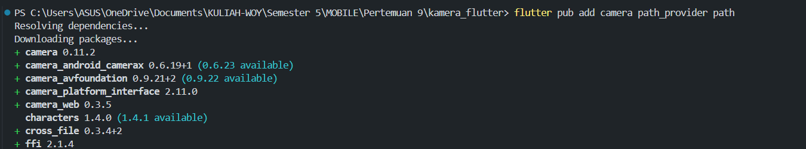
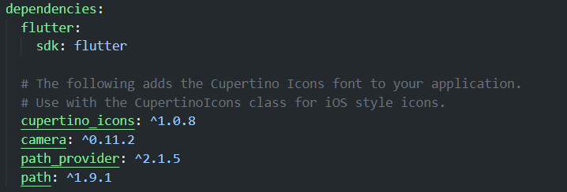
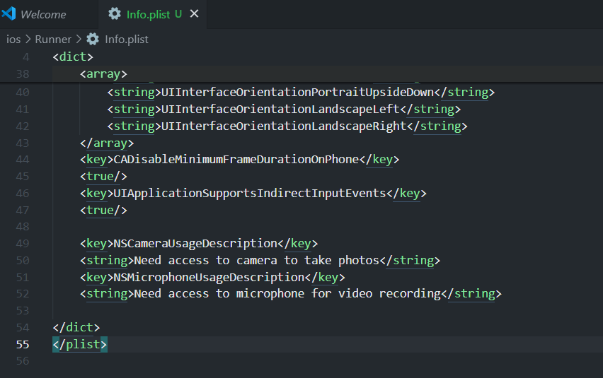
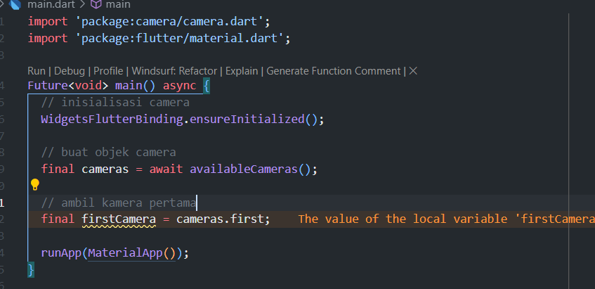
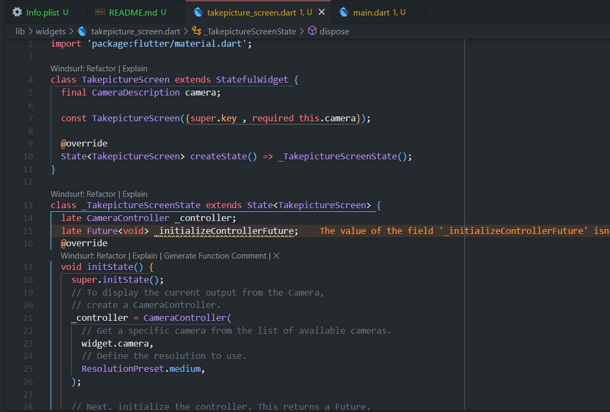
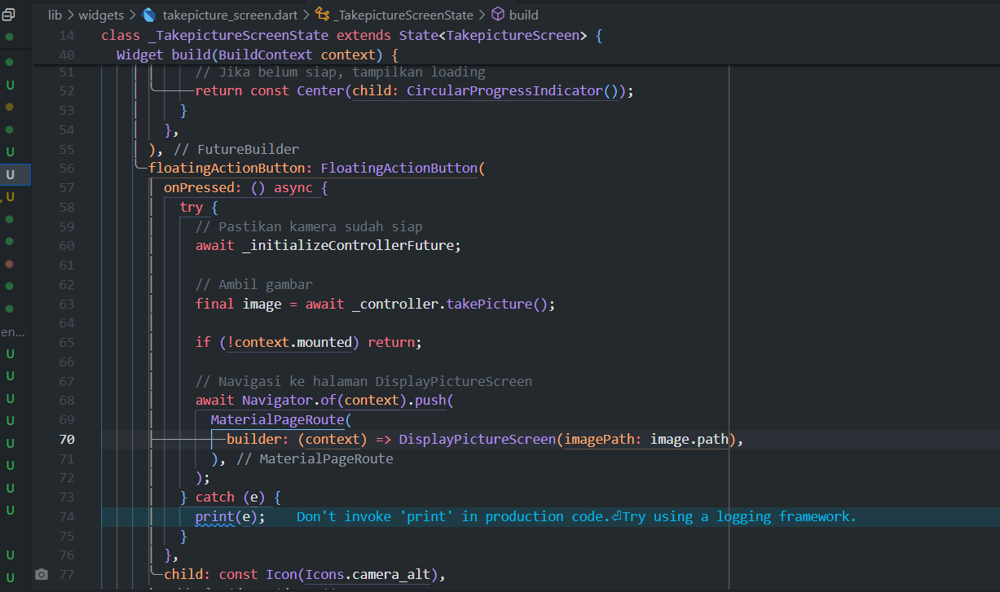
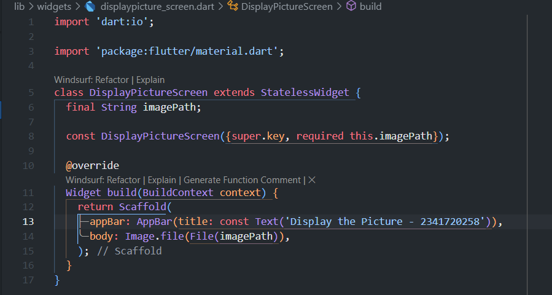
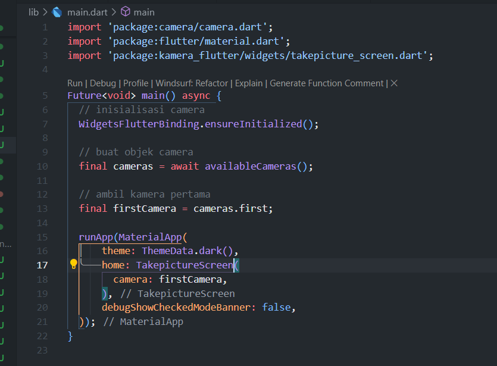
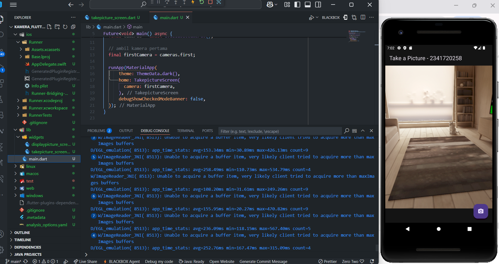

# Praktikum 1

## Menambahkan depedensi kamera
 

 

## Menambahkan izin untuk kamera dan mic di IOS

 

## ambil fungsi kamera dan ubah fungsi main menjadi async

 

## Buat dan inisialisasi CameraController

 

## Gunakan CameraPreview untuk menampilkan preview foto

 

## Buat kelas untuk display

 

## panggil fungsi di main

 

## Hasil
