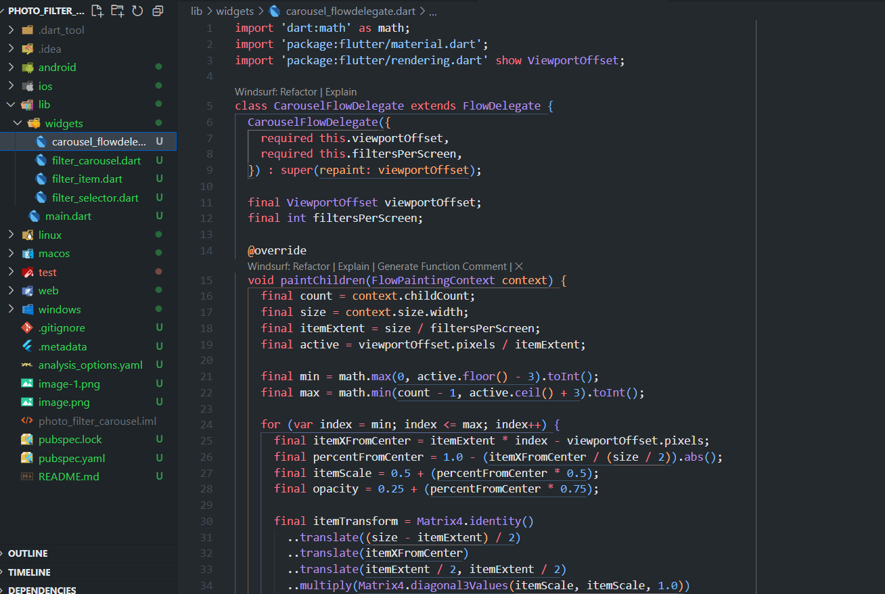

# Praktikum 2

## Buat widget Selector ring dan dark gradient

 

## Buat widget photo filter carousel

 

## Membuat filter warna - bagian 1

 

## Membuat filter warna

 

## Implementasi filter carousel

 

## Hasil
